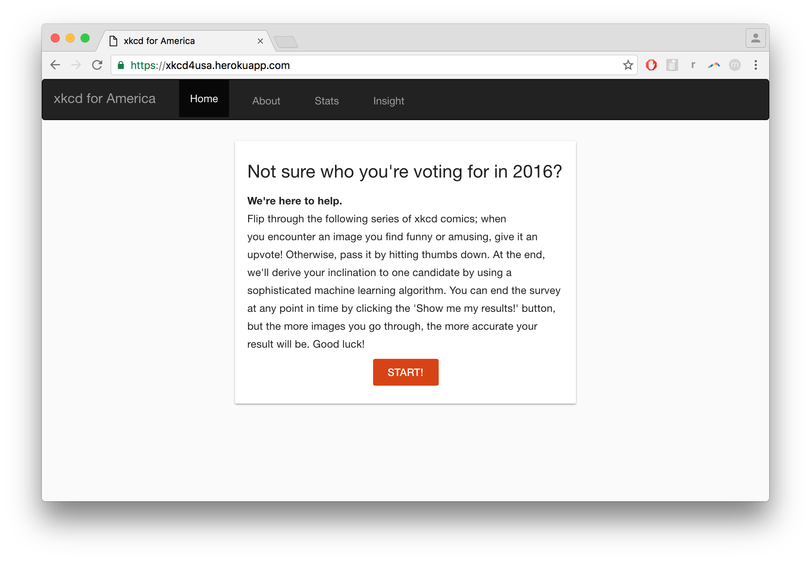

# xkcd for America
Make xkcd Great Again

Determine which candidate to vote for by throwing away your pre-conceived notions – using the art of xkcd

##Inspiration
Given the upcoming presidential election, we wanted there to be a fun way for people to determine which candidate aligned more with their interests, if they were to throw away all their pre-conceived notions about each candidate. We were interested in using Natural Language Processing and we all love reading xkcd comics, so we decided there was an interesting way we could integrate these two traditionally disparate tasks – reading funny comics vs. reading about presidential candidate election info/platforms.

##What it does
Essentially, we boiled it down to the very basics. Our users visit our site to find what appears to be a very simple quiz. You flip through a series of xkcd comics, and you either upvote it or downvote it to indicate whether you found it interesting/funny. At the end, we determine which candidate you have a closer affinity with and show you the collective data of all the people who've participated! 

##How we built it
We curated the speeches of Trump and Clinton from their election campaigns, as well as nearly all of Trump's tweets from the last year. From this text corpus, we ran the latent Dirichlet allocation (LDA) algorithm in order to get a collection of 'topics' (Trump topics and Clinton topics) – these topics were then mapped to the most closely corresponding xkcd comics. From there, we built a front-end interface where users could indicate their interest in each xkcd comic, which we tracked the results of to display a diagnosis at the end, regarding whether they displayed more interest in Clinton topics vs Trump topics. Each of the comics that the user likes counts as a vote for the candidate whose topic was associated with that comic. The candidate with the most likes is the selected candidate for the user. 

##Bonus Insight
We also ran several machine learning algorithms to look at word frequencies inside of the speeches to see patterns. We looked at the Wikipedia pages for them as well and looked at sentiment analysis of the pages and document distance to other pages. 

###About Us:

Zachery Miranda: Junior at MIT. 
Ryoya Ogishima: Junior at UTokyo. 
Cherrie Wang: Junior at USC. 
